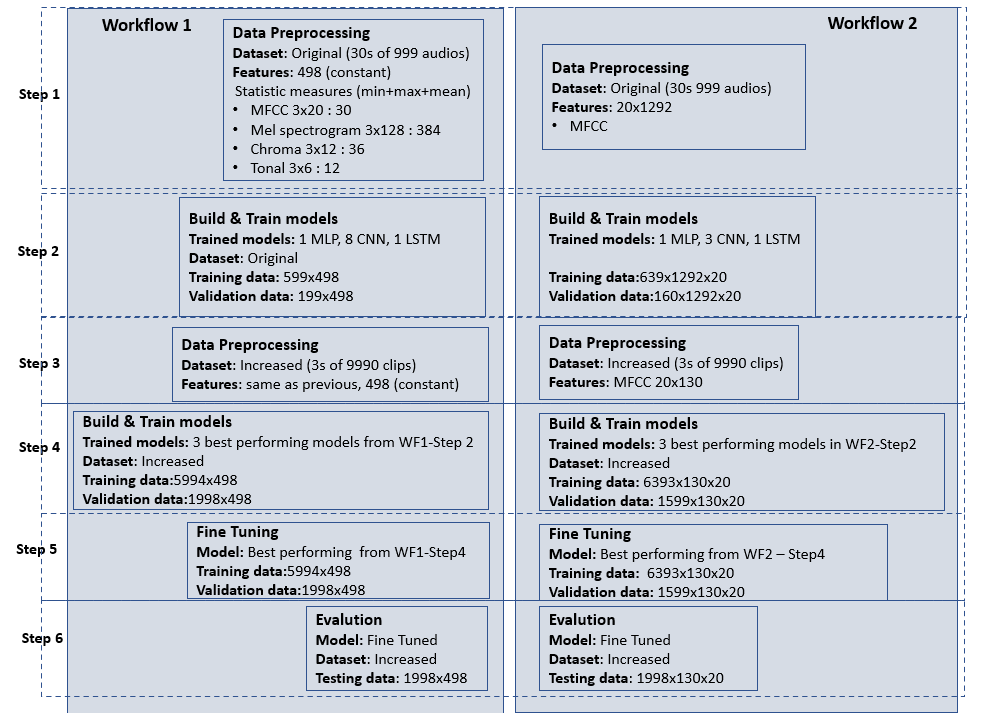

# Audio Multi Class Classification

### Dataset
This project uses GTZAN dataset1which is a collection of 10 genres with 100 audio files each, all having a length of approximately 30 seconds. The total number of audio files is 1000. The ten genres are: blues, classical, country, disco, hiphop, jazz, metal, pop, reggae and rock.

### Audio features
*Mel-frequency cepstral coefficients (MFCC)* Typically, 13 coefficients are used for speech representation but the first five coefficients provide the best genre classification performance. For this work, 20 MFCC coefficients is selected.

*Mel Spectrogram* 

*Chroma Vector* 

*Tonal Centroid Features* 

### Methodology
Two parallel workflows are set up and followed.

**Workflow 1 (WF1)** - Build audio genre classification models based on statistic measures (min, max and mean) of the selected audio features.

**Workflow 2 (WF2)** - Build audio genre classification models based only on selected audio features without any extra pre-processing.

### Tools
- Python (>=3.9.0)
- Librosa, a Python library for audio analysis.
- Tensorflow (>=2.12.0), an open source platform for machine l earning. 
- Keras, a high-level neural network library that runs on top of TensorFlow
- Keras Tuner, an easy-to-use, scalable hyperparameter optimization framework